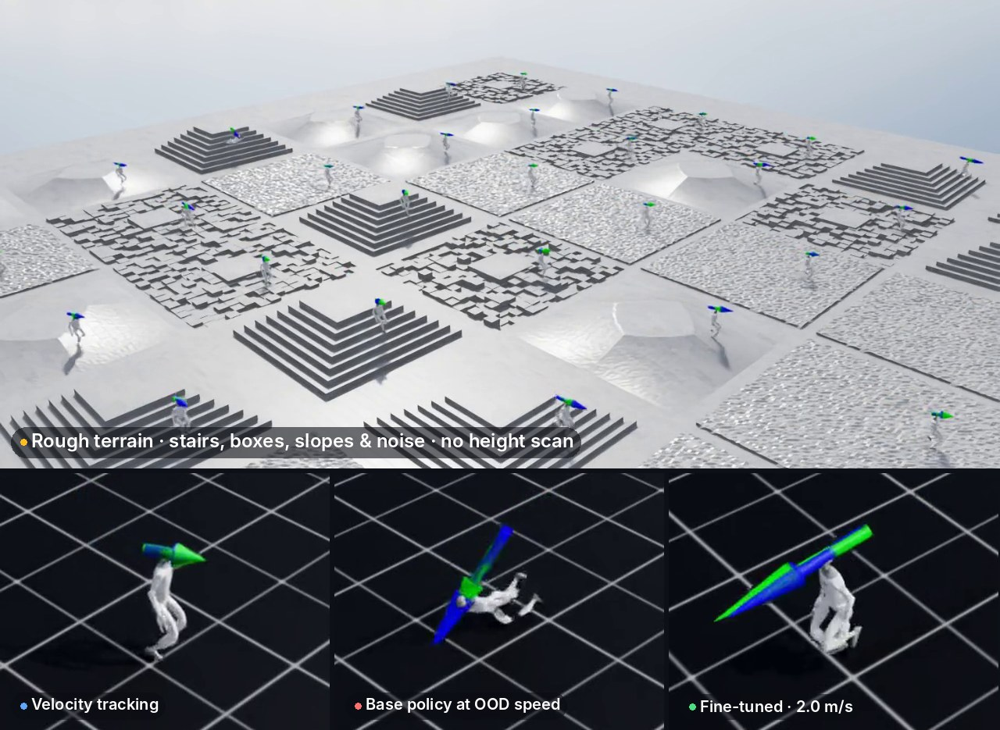
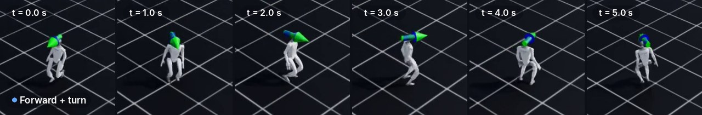
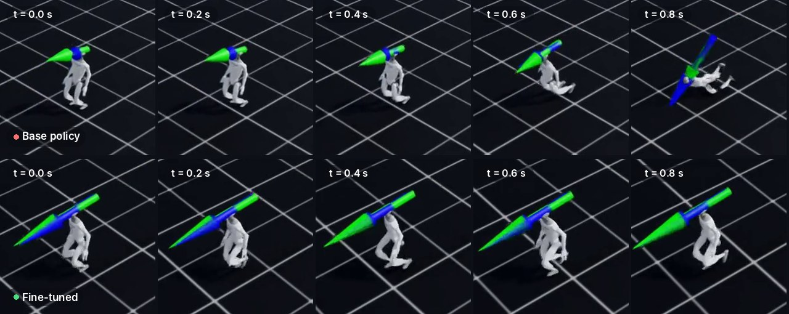
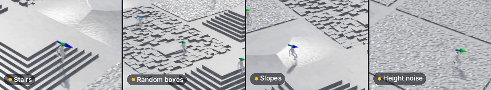

<h1 align="center">G1 Locomotion · Isaac Lab</h1>

<p align="center">
  <b>Teaching a Unitree G1 humanoid to walk with PPO, then pushing it past its training distribution:<br>
  twice the speed, and onto stairs, boxes and slopes without ever seeing the ground.</b>
</p>

<p align="center">
  
  
  
  <a href="report.pdf"></a>
</p>

<p align="center">
  
</p>

## Highlights

- **One policy, any goal.** A single velocity-tracking policy is frozen and steered to arbitrary 2D goals by a tiny proportional controller, with no goal-specific training.
- **1.3 → 2.0 m/s.** The base policy, trained on forward commands of at most 1 m/s, falls at 1.4 m/s. Fine-tuning on a wider command range gets it walking steadily at 2.0 m/s.
- **Blind rough-terrain walking.** The flat-ground policy is fine-tuned on stairs, random boxes, slopes and height noise *without* a height scanner, so the pretrained checkpoint loads unchanged and the robot relies on proprioception alone.

## Results

### Velocity tracking → goal reaching

<p align="center"></p>

The policy follows a commanded planar velocity $(v_x, v_y, \omega_z)$; the green arrow is the command, the blue arrow is the measured velocity. At inference the weights are frozen, and a P-controller turns the goal offset $(d_x, d_y)$ in the robot's yaw frame into a command:

$$
v_x = \mathrm{clip}(d_x, 0, 1), \quad v_y = \mathrm{clip}(d_y, -0.5, 0.5), \quad \omega_z = \mathrm{clip}(1.5\,\mathrm{atan2}(d_y, d_x), -1, 1)
$$

Within 0.35 m of the goal the command drops to zero and the robot stands. Clipping keeps every command inside the training range, so the policy only sees commands it was trained on.

### Out-of-distribution speed

<p align="center"></p>

| Policy | $v_x$ (m/s) | $v_y$ (m/s) | $\omega_z$ (rad/s) | Highest stable forward speed |
|---|---|---|---|---|
| Base | [0, 1] | [-0.5, 0.5] | [-1, 1] | 1.3 m/s (falls at 1.4) |
| Wide-$v_x$ (fine-tuned from base) | [0, 2] | [-0.2, 0.2] | [-0.5, 0.5] | **2.0 m/s** (every tested speed) |

Both policies were swept with fixed pure-forward commands from 0.2 to 2.0 m/s. Everything else (robot, terrain, observations, actions) stays the same, so commanded speed is the only variable.

### Rough terrain without a height scan

<p align="center"></p>

Rough-terrain policies normally observe a height scan, but adding one would change the 123-D observation and break the flat checkpoint. Instead, the flat policy is fine-tuned on Isaac Lab's official `ROUGH_TERRAINS_CFG` with an automatic terrain curriculum and the vertical-velocity penalty switched off, since climbing stairs needs vertical motion. After a short fine-tune of about 350 iterations, the curriculum climbs from level 1 to about 3.4, and the robot handles all four terrain types. It still falls on some of the hardest tiles, which is expected for a policy that only feels the ground after its feet hit it.

**Full clips:** [velocity tracking](assets/videos/BasePolicy-Left_Forward.mp4) · [base policy falling at OOD speed](assets/videos/BasePolicy-OOD_Fall.mp4) · [fine-tuned at 2 m/s](assets/videos/Exp1-MoveAt_vx=2.mp4) · [rough terrain, 36 robots](assets/videos/Exp2-RoughTerrain.mp4)

## How it works

| | |
|---|---|
| **Simulator** | Isaac Sim + Isaac Lab, 4096 parallel environments on GPU |
| **Algorithm** | PPO (RSL-RL), actor/critic MLPs `[256, 128, 128]`, 24 steps/env per iteration, γ = 0.99, λ = 0.95 |
| **Observation (123-D)** | base linear and angular velocity, projected gravity, velocity command, 37 joint positions, 37 joint velocities, previous action |
| **Action (37-D)** | joint position offsets: $q^{\text{target}} = q_0 + 0.5\,a$ |
| **Reward** | official G1 locomotion reward: velocity tracking + feet air time, with penalties for foot slip, body tilt, action rate, torque and joint limits |

The full derivation, training curves and discussion are in the **[report (PDF)](report.pdf)**. A Chinese version, [report-CHN.pdf](report-CHN.pdf), is an AI translation, so the English original is the reference.

## Repository layout

```
.
├── common/            # shared env.sh, train.py, play.py
├── g1_velocity/       # baseline: Isaac Lab's built-in Isaac-Velocity-Flat-G1-v0
├── g1_run_to_goal/    # velocity policy + goal controller + OOD-speed experiment
├── g1_rough/          # rough-terrain fine-tuning (no height scan)
├── assets/            # README images and demo videos
├── figures/           # report figures and training curves
├── report.pdf / .tex  # write-up (English)
└── report-CHN.pdf     # write-up (Chinese, AI-translated)
```

Each task directory has its own `train.sh` / `play*.sh` wrappers around `common/train.py` and `common/play.py`, plus logs, checkpoints and recorded videos. See [`g1_run_to_goal/README.md`](g1_run_to_goal/README.md) and [`g1_rough/README.md`](g1_rough/README.md) for details.

## Quick start

Requires a working Isaac Lab install and its conda env.

```bash
export ISAACLAB_PATH=/path/to/IsaacLab      # default: /data/Isaac-platform/IsaacLab
conda activate env_isaaclab
```

**Velocity policy and goal reaching**

```bash
cd g1_run_to_goal
./train.sh                 # velocity tracking, v_x ∈ [0, 1]
./play_to_goal.sh          # frozen policy + P-controller → videos/play_to_goal/
./play_forward.sh          # fixed forward-speed sweep → videos/play_forward/
./train_wide_vx.sh logs/rsl_rl/g1_run_to_goal/2026-07-11_16-04-20/model_1749.pt
```

**Rough terrain**

```bash
cd g1_rough
./train.sh ../g1_run_to_goal/logs/rsl_rl/g1_run_to_goal/2026-07-11_16-04-20/model_1749.pt
./play_hard_demo.sh logs/rsl_rl/g1_rough/2026-07-12_00-40-00/model_2100.pt
```

**Flat baseline**

```bash
cd g1_velocity && ./train.sh && ./play.sh
```

## Checkpoints

All trained weights are included in the repo.

| Policy | Path |
|---|---|
| Flat baseline | `g1_velocity/logs/rsl_rl/g1_flat/2026-07-11_12-45-01/model_1499.pt` |
| Base velocity policy ($v_x \le 1$) | `g1_run_to_goal/logs/rsl_rl/g1_run_to_goal/2026-07-11_16-04-20/model_1749.pt` |
| Wide-$v_x$ ($v_x \le 2$) | `g1_run_to_goal/logs/rsl_rl/g1_wide_vx/2026-07-11_23-01-24/model_2600.pt` |
| Rough terrain | `g1_rough/logs/rsl_rl/g1_rough/2026-07-12_00-40-00/model_2100.pt` |

## Limitations

- The speed and terrain results are judged from recorded rollouts, not repeated trials or numerical benchmarks.
- Rough-terrain training stopped early (iteration 2100 of a planned ~2750), and the policy is blind to terrain ahead.
- Everything runs in simulation only; there has been no sim-to-real transfer.

## Background

This project started as the final project for *Introduction to Robotics* at Nanjing University (2026). The original brief is kept in [`docs/`](docs/RoboIntro2026-Assignment.md).
